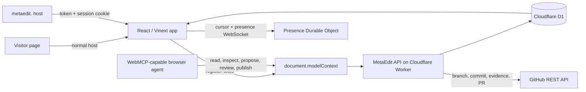

# MetaEdit

## Edit software from inside the software

MetaEdit turns a live website into a collaborative review space.

A visitor sees the normal site. A collaborator adds `metaedit.` to the site's hostname, enters the shared access token, and can point at any part of the page. They write what should change. A browser agent reads that request through WebMCP, proposes a safe preview, and leaves the final decision with the people reviewing the page.

The team can see each other's names and cursors, compare the current page with a proposed result, approve or reject the change, and open a GitHub pull request from the same screen. The public page changes only after the team chooses to publish.

I was heavily inspired by [React Grab](https://www.react-grab.com/) by [Aiden Bai](https://www.aidenybai.com/)

## Try the live demo

- [Open the visitor site](https://me.sin4.ch/)
- [Open the MetaEdit workspace](https://metaedit.me.sin4.ch/)

Demo access:

- **Name:** any name, such as `Alex Rivera`
- **Token:** `WEBMCP`

### How to use it

1. Open the MetaEdit workspace and enter a name and `WEBMCP`.
2. Click an element, or drag a freeform rectangle across several elements and whitespace.
3. Type the change you want and save the annotation.
4. In a WebMCP-capable browser agent, read the annotations, inspect the target, and propose a revision.
5. Open **Activity**. Use the eye button to switch between the current page and the proposed result.
6. Approve the revision. After one approval, the rocket appears. Confirm it to create the pull request.
7. Open the GitHub link on the activity entry to review the branch, patch, manifest, and before/after evidence.

The activity feed keeps the author, target, time, reactions, approvals, and revision history together.

## Why WebMCP matters here

WebMCP gives a browser agent real information and actions from a web page. MetaEdit uses it so the agent can work with the same workspace as the people looking at the page. There is no separate chat window to copy between.

The agent can:

1. read the workspace and find open annotations;
2. inspect the selected element or freeform region, including its selector, text, styles, and author;
3. propose a preview-only revision;
4. let people review it in the page; and
5. publish the approved result through the same tool surface.

The agent does not need to clone the repository to understand the request or produce the preview. Publishing uses the server-side GitHub API to create the review branch and pull request.

## What the product protects

- **Visitors stay visitors.** The editor, cursors, inspector, and WebMCP tools appear only in the authenticated MetaEdit workspace.
- **The page supplies context.** Each annotation remembers the selected part, what it looked like, what the person asked for, and who asked.
- **Agents get a narrow edit contract.** A revision can change text, styling, or visibility in the selected area. It cannot inject scripts, arbitrary code, or changes somewhere else on the page.
- **People stay in control.** A revision is a preview until a collaborator approves it. Publishing asks for confirmation and then opens a pull request.
- **The workspace remembers.** Annotations, revisions, approvals, activity, and published versions are stored durably. Presence and cursors are live, but leaving the workspace does not remove the record of what happened.

## Technical notes

### Architecture

### Stack and responsibilities

- **React, Next-compatible App Router, and Vinext:** visitor page, inspector, activity popover, before/after preview, and WebMCP registration.
- **Cloudflare Worker:** serves the app and handles authenticated MetaEdit actions at `/api/metaedit`.
- **Cloudflare D1:** durable workspace data, including annotations, revisions, approvals, activity, and publish state.
- **Cloudflare Durable Object:** one WebSocket room for live collaborator presence and document-space cursor positions. D1 remains the source of truth.
- **GitHub REST API:** creates a `metaedit/revision-*` branch, applies a conservative exact text replacement when the source snapshot is safe, commits the revision manifest and cropped evidence, and opens the pull request.
- **OpenAI Sites integration:** `.openai/hosting.json` keeps the project compatible with the local Sites runtime; WebMCP itself is registered by the page, not through a proxy endpoint.

### WebMCP tools

After authentication, the page registers these tools on the browser's `document.modelContext` API:

| Tool | What it does |
| --- | --- |
| `metaedit_get_workspace` | Reads the current version, people, annotations, revisions, approvals, and published version. |
| `metaedit_list_annotations` | Lists open, resolved, or all annotations with target snapshots and attribution. |
| `metaedit_inspect_annotation` | Reads one annotation and its related revisions. |
| `metaedit_create_annotation` | Saves an element or freeform-region annotation. |
| `metaedit_propose_revision` | Saves a preview-only text, style, or visibility patch. |
| `metaedit_review_revision` | Records an approval or rejection. |
| `metaedit_publish_revision` | Opens a GitHub pull request after at least one approval. |
| `metaedit_focus_target` | Scrolls to and highlights an annotated target for the human reviewer. |

Mutating calls use idempotency keys. The server authenticates every privileged action and treats annotation text, selectors, and agent-provided content as untrusted input.

## License

MIT. See [LICENSE](LICENSE).
